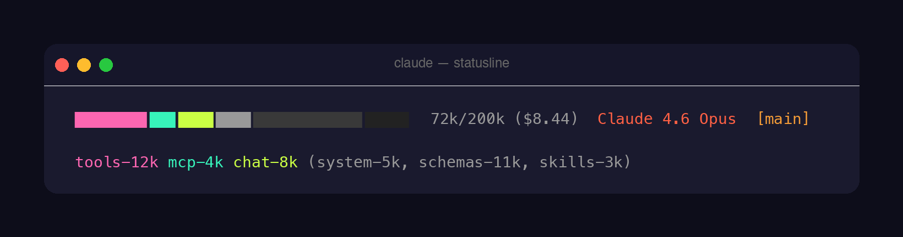

# Claude Context Visualizer

A statusline for [Claude Code](https://docs.anthropic.com/en/docs/claude-code) that shows both your **API usage limits** and **context window breakdown** — so you always know how much capacity you have left.




## Install

```bash
curl -fsSL https://raw.githubusercontent.com/rohankmr414/claude-usage-limit-visualizer/main/install.sh | bash
```

Then restart Claude Code.

## Update

To update to the latest version, re-run the install command:

```bash
curl -fsSL https://raw.githubusercontent.com/rohankmr414/claude-usage-limit-visualizer/main/install.sh | bash
```

This overwrites the scripts with the latest version while preserving your `settings.json` configuration.

## What You Get

A compact 2-line status bar at the bottom of every Claude Code session:

```
 ███████▊████▊█▊███▊█████████████▊████▊  50k/200k  5h 62% ↑2h13m · 7d 88%  Opus 4  [main]
 tools-5k mcp-2k chat-8k (system-15k, skills-1k, memory-2k)
```

### Line 1: Context bar + stats + limits

A stacked bar showing how your context window tokens are distributed, followed by token counts, usage limits, the model name, and the current git branch.

**Context bar segments:**

| Color | Segment | Description |
|-------|---------|-------------|
| Pink | tools | Token results from Read, Grep, Bash, etc. |
| Teal | mcp | MCP tool results (Figma, Supabase, Slack, etc.) |
| Green | chat | User messages + assistant responses |
| Grey | system | System prompt, skills, memory files |
| Dark grey | free | Remaining usable space |
| Near-black | buffer | Autocompact buffer (16.5%, reserved) |

**Usage limit colors** (Pro/Max only):

| Color | Meaning | Remaining |
|-------|---------|-----------|
| White | Plenty left | > 50% |
| Yellow | Moderate | 30–50% |
| Orange | Getting low | 15–30% |
| Red | Critical | < 15% |

Both the 5-hour and 7-day limits are shown inline with remaining percentage and time until reset (e.g., `5h 62% ↑2h13m · 7d 88%`).

**Context warnings**: `!` at 70% usage, `[/clear]` at 85%.

**API key users** see session cost instead of usage limits (e.g., `50k/200k ($8.44)`).

### Line 2: Context legend

A breakdown of token consumption by category: `tools`, `mcp`, `chat`, plus the fixed overhead split into `system`, `skills`, and `memory`.

## How It Works

Two scripts work together:

- **`statusline.sh`** — reads the JSON that Claude Code pipes to `statusLine.command` on stdin. It renders the context bar, token stats, color-coded usage limits, model name, and git branch — all in a single render pass. Includes auto-calibration of system overhead (measured from the first few renders before any tools run) and compaction detection (resets tracker when token count drops >20% to avoid stale ratios).

- **`context-tracker.sh`** — a `PostToolUse` hook that estimates token consumption per tool call (~4 chars/token) and writes running totals to `/tmp/claude-context-tracker/<session>.json`. This powers the tools/mcp/chat breakdown in the context bar. Uses file locking for concurrency safety.

### Architecture

```
Claude Code
  ├─ statusLine command ──→ statusline.sh ──→ reads JSON + tracker ──→ renders 2-line status
  └─ PostToolUse hook ────→ context-tracker.sh ──→ writes tracker JSON
```

## Requirements

- [Claude Code](https://docs.anthropic.com/en/docs/claude-code) (any version with `statusLine` support)
- `jq` — JSON processor (`brew install jq` / `apt install jq`)
- macOS or Linux
- Any terminal — auto-detects color support (truecolor, 256-color, or basic 16-color)
- Claude.ai Pro or Max subscription (for usage limit data; context window works for all users)

## Uninstall

```bash
curl -fsSL https://raw.githubusercontent.com/rohankmr414/claude-usage-limit-visualizer/main/uninstall.sh | bash
```

Or run locally:

```bash
./uninstall.sh
```

This removes both scripts, the tracker hook, and cleans `settings.json`.

## License

MIT
